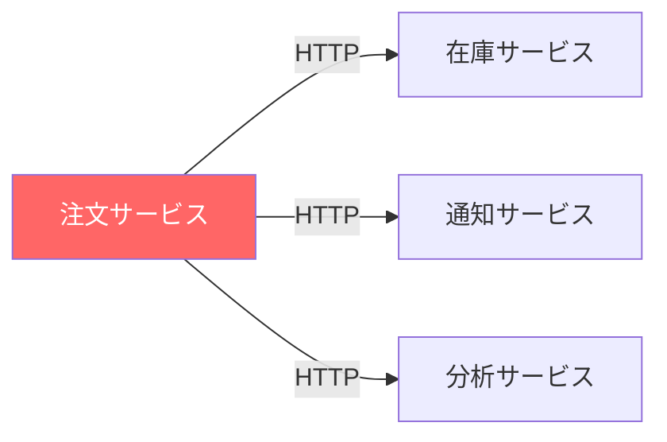
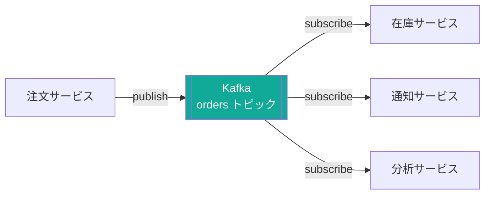

# Kafka とは

## 概要

Apache Kafka は 分散ストリーミングプラットフォーム。
もとは LinkedIn が社内の大量ログを処理するために開発し、2011 年に OSS として公開された。

主な用途:

| 用途 | 例 |
|------|----|
| サービス間の非同期メッセージング | 注文サービス → 在庫サービスへ通知 |
| イベントソーシング | ユーザー操作履歴をすべてイベントとして保存 |
| ストリーム処理 | リアルタイム集計・異常検知 |
| ログ収集 | 複数サーバーのログを一箇所に集める |

## Kafka がなかった場合

### サービス間を直接繋いだ場合の問題

Kafka のようなメッセージ基盤がない場合、サービス同士が直接 HTTP などで通信することになる。



問題:
- 呼び出し先が増えるたびに注文サービスの修正が必要
- 在庫サービスが落ちていると注文処理全体がブロックされる
- 通知サービスへの送信が失敗してもリトライの仕組みを自前で作る必要がある

### Kafka を挟んだ場合



メリット:
- 注文サービスはトピックに書くだけ。下流の増減を意識しない
- 在庫サービスが落ちていてもメッセージは Kafka に残り、復旧後に処理できる
- リトライ・順序保証・再処理は Kafka が担う

### 具体的に何が困るか

| 問題 | Kafka なしの場合 | Kafka ありの場合 |
|------|-----------------|-----------------|
| 下流サービスの障害 | 上流も連鎖して失敗する（同期的な依存） | Kafka にバッファされ、復旧後に消費できる |
| 下流サービスの追加 | 上流サービスのコードを修正して呼び出しを追加する必要がある | 新サービスが Kafka をサブスクライブするだけで追加できる |
| 大量トラフィック | 下流が捌ききれず、上流がタイムアウトや溢れを起こす | Kafka がバッファになり、下流は自分のペースで消費できる |
| ログの再処理 | 送信済みデータは消えており、再処理が困難 | 保持期間内であれば何度でもリプレイできる |

## Kafka の特徴

| 特徴 | 説明 |
|------|------|
| 分散システム | 複数の Broker にデータを分散・複製し、高可用性とスケールアウトを実現する |
| ディスクへの永続化 | Message をディスクに書き込み、Consumer が受け取った後も一定期間保持する |
| メッセージ送達保証 | at-most-once / at-least-once / exactly-once の3段階から用途に合わせて選択できる |
| シンプルな API | Producer / Consumer / Streams / Connect の4つの API で主要ユースケースを網羅する |

### 分散システム

Kafka は複数の **Broker（サーバー）** をクラスターとして束ねることで動作する。
トピックは **Partition** という単位に分割され、各 Partition が異なるブローカーに配置される。

- スケールアウト: Partition を増やすことで書き込み・読み取りの並列度を上げられる
- レプリケーション: 各 Partition は指定した数だけ他のブローカーにコピーされる（`replication.factor`）
- フェイルオーバー: Leader ブローカーが落ちても Follower が自動的に引き継ぐため、サービスを止めずに運用できる

```
Cluster
├── Broker 1  ── Partition 0 (Leader), Partition 1 (Follower)
├── Broker 2  ── Partition 0 (Follower), Partition 1 (Leader)
└── Broker 3  ── Partition 0 (Follower), Partition 1 (Follower)
```

### ディスクへの永続化

多くのメッセージキューはメモリを主記憶として使うが、Kafka はメッセージを ディスクに順次書き込む（Sequential Write） 設計を採用している。

- 高スループット: シーケンシャルな I/O はランダムアクセスより大幅に高速で、HDDでも十分なパフォーマンスが出る
- 保持期間: デフォルトは 7 日間。期間はトピック単位で設定できる（`retention.ms`）
- オフセット管理: Consumer はどこまで読んだかを **オフセット** として持つ。保持期間内であれば任意の時点から再読み込み（リプレイ）が可能

### メッセージ送達保証

Kafka は送達保証レベルを3段階から選べる。

| レベル | 動作 | 用途例 |
|--------|------|--------|
| at-most-once | 最大1回。消失する可能性あり | ログ収集など、多少の欠損が許容される場合 |
| at-least-once | 最低1回。重複する可能性あり | 一般的な業務イベント（冪等な処理が前提） |
| exactly-once | 厳密に1回 | 金融取引・在庫更新など重複が許されない場合 |

exactly-once を実現するには Producer 側の 冪等性（`enable.idempotence=true`） と トランザクション API を組み合わせて使う。

### シンプルな API

Kafka は用途に応じた4つの API を提供しており、必要な機能だけを選んで使える。

| API | 役割 |
|-----|------|
| Producer API | トピックへメッセージを送信する |
| Consumer API | トピックからメッセージを読み取る |
| Streams API | トピックのデータをリアルタイムに変換・集計する（Kafka 内で完結） |
| Connect API | DB・S3 などの外部システムと Kafka を繋ぐコネクターを定義する |

## Kafka が向いている場面・向いていない場面

向いている:
- 大量のデータを高スループットで処理したい
- メッセージを後から再処理（リプレイ）したい
- 複数のシステムが同じイベントを独立して消費したい

向いていない:
- メッセージ数が少なく、シンプルなキューで十分な場合
- 個々のメッセージに対して細かい優先度制御が必要な場合
