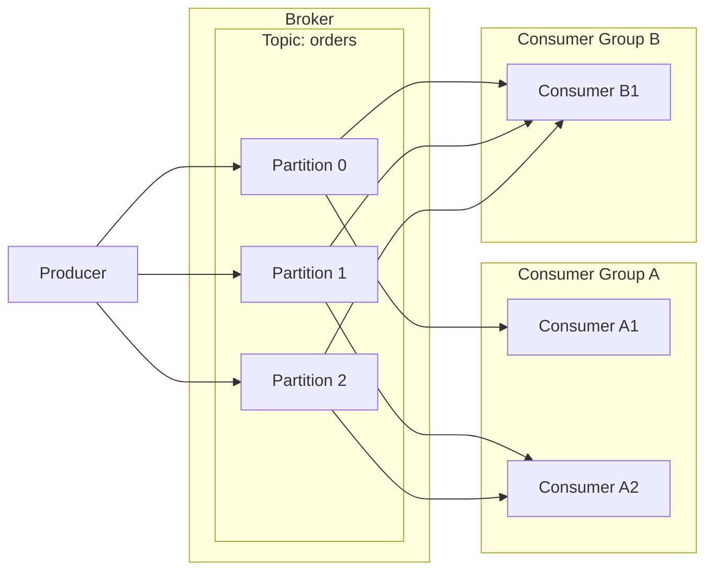
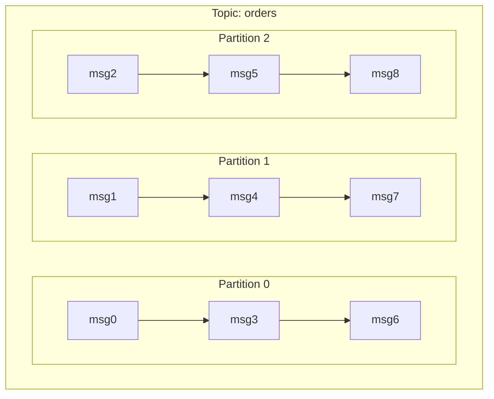
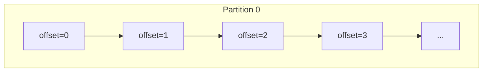
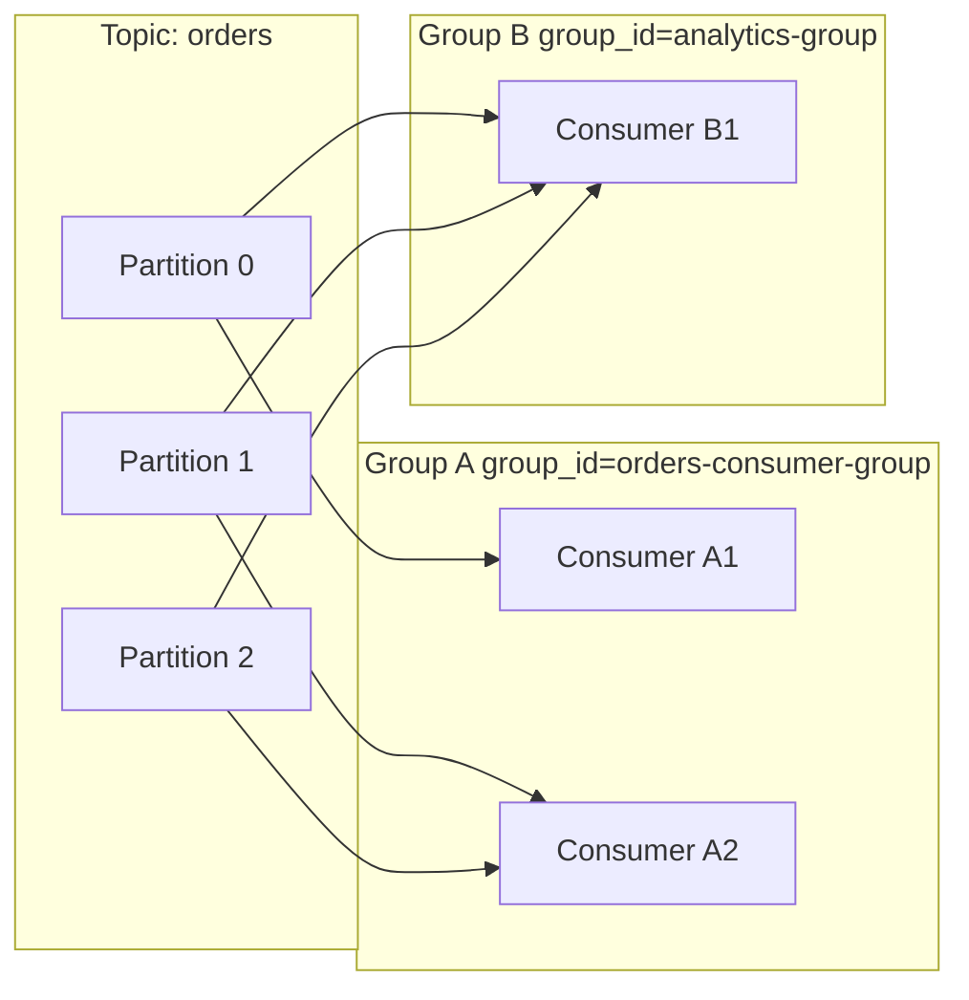

# Kafka の基本概念

## 登場人物の全体像



---

## Broker

Kafka サーバーそのもの。メッセージの受け取り・保存・配信を担う。
本番環境では複数の Broker をクラスタ構成にして冗長化する。

このプロジェクトでは `compose.yaml` で 1 台だけ起動している。

```yaml
# compose.yaml
services:
  kafka:
    image: apache/kafka:3.8.0
    ports:
      - "9092:9092"
```

---

## Topic

メッセージを分類するための論理的なチャンネル。
RDB でいうテーブルに近いイメージ。

- Producer はトピックを指定してメッセージを送る
- Consumer はトピックを購読してメッセージを受け取る

このプロジェクトでは `orders` というトピックを使っている。

```python
# producer.py / consumer.py
TOPIC = "orders"
```

---

## Partition

トピックを物理的に分割したもの。Kafka の並列性とスケールの源泉。



- 同一 Partition 内ではメッセージの順序が保証される
- Partition が多いほど並列処理できる Consumer を増やせる
- Producer がキーを指定するとキーのハッシュで Partition が決まる（同じキーは必ず同じ Partition へ）

```python
# producer.py: キー付きで送信 → 同じ order_id は同じ Partition へ
future = producer.send(TOPIC, key=key, value=order)
```

---

## Offset

Partition 内のメッセージに付与される**連番の位置情報**。0 始まり。



Consumer は「どこまで読んだか（Offset）」を Kafka に保存（コミット）する。
再起動しても続きから読み始められる。

```python
# consumer.py
auto_offset_reset="earliest"  # 初回または未コミット時は先頭から読む
enable_auto_commit=True        # 読んだら自動でオフセットをコミット
```

---

## Producer

メッセージを Kafka に**送信する**側。

- `bootstrap_servers` で接続先 Broker を指定
- `value_serializer` でメッセージをバイト列に変換
- キーを指定すると同じキーのメッセージが同じ Partition に入る

```python
# producer.py
producer = KafkaProducer(
    bootstrap_servers="localhost:9092",
    value_serializer=lambda v: json.dumps(v).encode("utf-8"),
    key_serializer=lambda k: k.encode("utf-8"),
)
producer.send("orders", key="order-1", value={"order_id": 1, ...})
```

---

## Consumer

メッセージを Kafka から**受信する**側。
`for message in consumer` でブロッキングしながらメッセージを待ち受ける。

```python
# consumer.py
consumer = KafkaConsumer(
    "orders",
    bootstrap_servers="localhost:9092",
    value_deserializer=lambda v: json.loads(v.decode("utf-8")),
    group_id="orders-consumer-group",
    auto_offset_reset="earliest",
)
for message in consumer:
    print(message.value)
```

---

## Consumer Group

複数の Consumer をひとつのグループとして扱う仕組み。

- 同じ `group_id` を持つ Consumer は**ロードバランシング**される（各 Partition は 1 Consumer にのみ割り当て）
- 異なる `group_id` のグループは**同じメッセージを独立して受け取れる**（ブロードキャスト的）



Consumer 数が Partition 数を超えると、余った Consumer はアイドル状態になる。
→ Partition 数が並列度の上限。

---

## メッセージの構造

| フィールド | 説明 |
|-----------|------|
| `topic` | 送信先トピック名 |
| `partition` | 格納された Partition 番号 |
| `offset` | Partition 内の位置 |
| `key` | メッセージのキー（任意） |
| `value` | メッセージ本体 |
| `timestamp` | 送信時刻 |

```python
for message in consumer:
    print(message.topic)      # "orders"
    print(message.partition)  # 0, 1, 2 ...
    print(message.offset)     # 0, 1, 2 ...
    print(message.key)        # "order-1"
    print(message.value)      # {"order_id": 1, "item": "Apple", ...}
```
