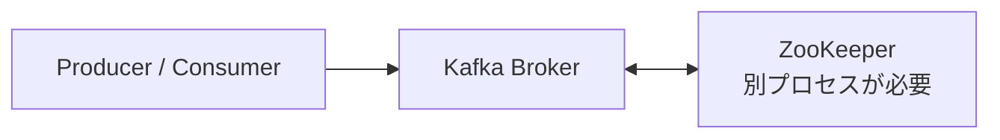
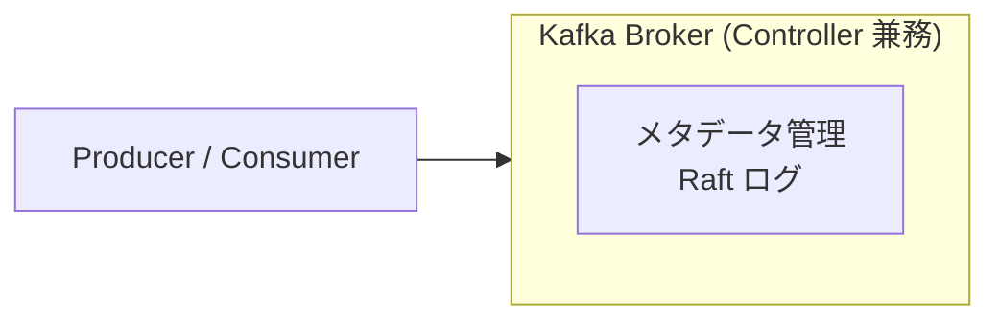
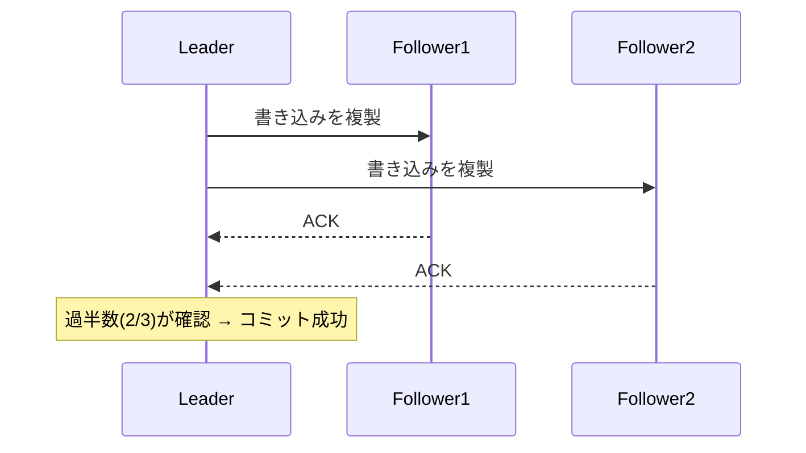

# KRaft モード（ZooKeeper レス構成）

## 背景

Kafka は長年 ZooKeeper をクラスタのメタデータ管理（どの Broker がリーダーか、トピック情報など）に使ってきた。



ZooKeeper の課題:
- 運用するプロセスが 2 種類になる
- ZooKeeper 自体のクラスタ管理が必要
- メタデータの同期に遅延が生じることがある
- Partition 数のスケールに限界があった

---

## KRaft とは

**Kafka Raft Metadata mode** の略。
Kafka 自身が Raft コンセンサスアルゴリズムを使ってメタデータを管理する。ZooKeeper が不要になる。

Kafka 3.3 で本番利用可能（GA）になり、Kafka 4.0 以降は ZooKeeper モードが廃止された。



---

## このプロジェクトの設定

```yaml
# compose.yaml
environment:
  KAFKA_PROCESS_ROLES: broker,controller   # 1 ノードで Broker と Controller を兼務
  KAFKA_NODE_ID: 1
  KAFKA_LISTENERS: PLAINTEXT://0.0.0.0:9092,CONTROLLER://0.0.0.0:9093
  KAFKA_CONTROLLER_QUORUM_VOTERS: 1@kafka:9093  # クォーラムメンバーの一覧
```

| 設定項目 | 説明 |
|---------|------|
| `KAFKA_PROCESS_ROLES` | `broker`（メッセージ処理）と `controller`（メタデータ管理）を同一ノードで担う |
| `KAFKA_NODE_ID` | クラスタ内のノード識別子 |
| `KAFKA_CONTROLLER_QUORUM_VOTERS` | `{node_id}@{host}:{port}` の形式でクォーラムメンバーを列挙 |

---

## Controller の役割

- トピック・Partition のメタデータを保持
- リーダー選出（どの Broker が Partition のリーダーになるか）
- Broker の死活監視

本番クラスタでは Controller 専用ノードを 3〜5 台用意して Raft で合意を取る。
このプロジェクトは 1 ノード構成なのでシングルポイントだが、学習目的には十分。

---

## Raft の簡単なしくみ

クラスタ内でリーダーを選出し、リーダーが書き込みを受け付けてフォロワーに複製する。
過半数（クォーラム）が確認したら書き込み成功とみなす。



1 台が落ちても残り 2 台（過半数）で動き続けられる。
